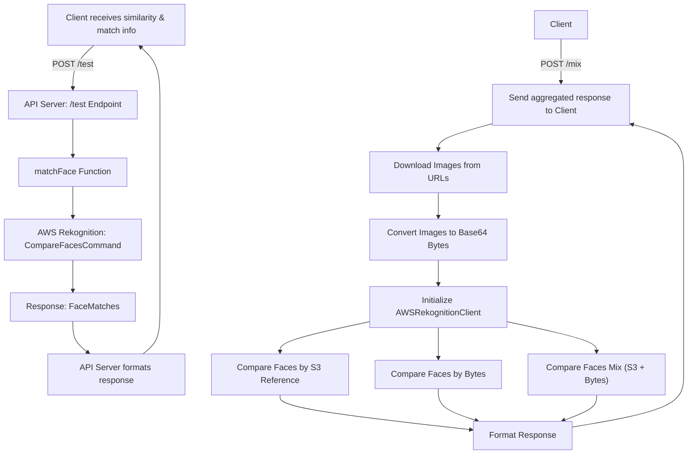

# Face Matching API

A Node.js API using **AWS Rekognition** to compare and match faces in images. It supports multiple comparison methods, including S3 references, Base64 image data, and mixed approaches.

---

## Table of Contents

1. [Installation](#installation)
2. [Environment Setup](#environment-setup)
3. [API Endpoints](#api-endpoints)
   - [POST /test](#post-test)
   - [POST /mix](#post-mix)

4. [AWS Rekognition Client](#aws-rekognition-client)
5. [Face Matching Utility](#face-matching-utility)
6. [Swagger Documentation](#swagger-documentation)

---

## Installation

```bash
git clone <repository-url>
cd <project-directory>
npm install
npm run dev
```

This will start the server on **[http://localhost:3000](http://localhost:3000)**.

---

## Environment Setup

Create a `.env` file in the root of the project:

```env
AWS_REGION=<your-aws-region>
AWS_ACCESS_KEY_ID=<your-access-key>
AWS_SECRET_ACCESS_KEY=<your-secret-key>
AWS_BUCKET_NAME=<your-s3-bucket-name>
PORT=3000
SAMPLE_IMAGE_URLS=[s3 bucket url1],[s3 bucket url2]
```

Make sure the AWS credentials have access to **Rekognition** and the S3 bucket where images are stored.

---

## API Endpoints

### POST `/test`

Compare two images in S3 and get a similarity score.

**Request Body:**

```json
{
  "referenceImage": "<reference-image-file-name-in-S3>",
  "srcImage": "<source-image-file-name-in-S3>"
}
```

**Response:**

```json
{
  "hasMatch": true,
  "score": 99.5,
  "mostSignificantMatch": {
    "BoundingBox": {...},
    "Confidence": 99.9
  }
}
```

**Error Response:**

```json
{
  "error": "Internal server error"
}
```

**Description:**
Uses AWS Rekognition to compare two faces from S3 objects and returns whether a match exists, the similarity score, and the most significant face match.

---

### POST `/mix`

Compare two faces using multiple methods:

1. Using S3 references
2. Using Base64 image bytes
3. Using a mixed approach (S3 + Base64)

**Request Body:**

```json
{
  "srcImageUrl": "<source-image-url>",
  "targetImageUrl": "<target-image-url>"
}
```

**Response:**

```json
{
  "s3ReferenceResponse": {...},
  "bytesResponse": {...},
  "mixResponse": {...}
}
```

**Error Response:**

```json
{
  "error": "Internal server error"
}
```

**Description:**
Downloads images from URLs, converts them to Base64 if needed, and runs three types of AWS Rekognition face comparisons. Useful for testing different matching approaches.

---

## AWS Rekognition Client

The `AWSRekognitionClient` class wraps AWS Rekognition methods:

- **compareFacesByS3Reference(sourceReference, targetReference)**
  Compare faces stored in S3.

- **compareFacesByBytes(sourceBytes, targetBytes)**
  Compare faces using Base64/byte arrays.

- **compareFacesMix(sourceReference, referenceBytes)**
  Mixed approach: S3 object for source, byte array for target.

- **convertToBase64(url)**
  Converts an image URL to Base64 for Rekognition.

**Usage Example:**

```ts
const rekognitionService = new AWSRekognitionClient()
const result = await rekognitionService.compareFacesByS3Reference('src.jpg', 'target.jpg')
console.log(result)
```

---

## Face Matching Utility

The `matchFace` function is a simple wrapper for AWS Rekognition **CompareFacesCommand**:

```ts
const result = await matchFace('reference.jpg', 'source.jpg')
```

**Returns:**
AWS Rekognition output including `FaceMatches` and similarity scores.

---

## Swagger Documentation

The project includes **Swagger UI** for interactive API documentation:

- URL: [http://localhost:3000/api-docs](http://localhost:3000/api-docs)

It documents:

- `POST /test` – Single face comparison
- `POST /mix` – Multi-method face comparison

---



## Notes

- Similarity threshold is set to **98%** by default.
- Quality filter is **HIGH** for more accurate matches.
- Ensure images are accessible in the S3 bucket or via URL for the mix API.
- Logging is added to help debug S3 references and Base64 conversions.
